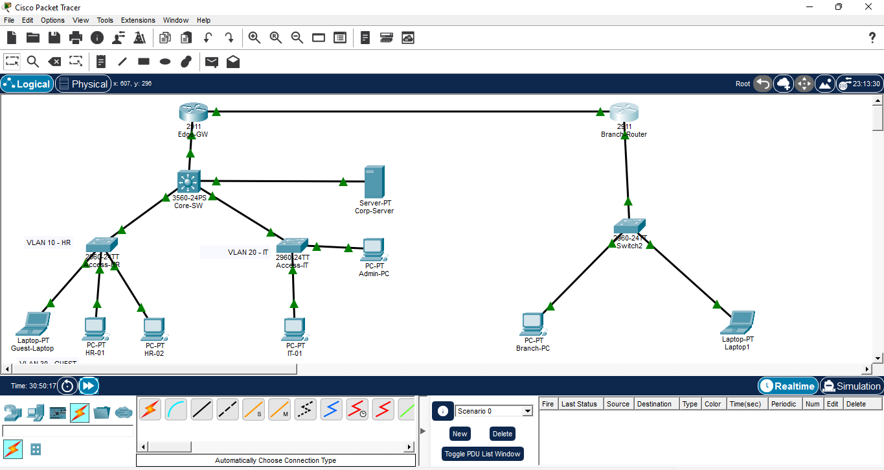
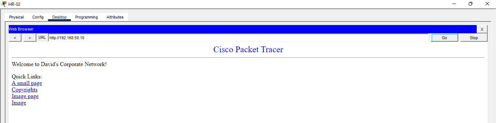

# Corporate Multi-Site Network Infrastructure
**CCNA Level Implementation | Layer 3 Switching & OSPF Routing**

## 🚀 Project Overview
This project demonstrates an intermediate-level enterprise network designed in Cisco Packet Tracer. It features a collapsed core architecture with a dedicated Edge Gateway and a remote Branch office connected via OSPF.

### Key Technical Features:
* **VLAN Segmentation:** Isolated departments (HR, IT, Guest, Management, and Services) using 802.1Q trunking.
* **Layer 3 Intelligence:** Inter-VLAN routing performed on a Multi-Layer Switch (Core-SW).
* **Security & Hardening:** * Extended ACLs to prevent Guest access to Management and Branch subnets.
    * Secured Management via SSH (v2) with local AAA.
    * Native VLAN migration (VLAN 777) to prevent VLAN hopping.
* **Automation:** Integrated DHCP pools for automatic IP assignment.
* **Routing:** OSPF (Area 0) for multi-site connectivity and Static Default Routing for ISP egress.

## 🛠️ Topology Diagram

## 🧪 Verification Results
### Web Service Access
The following screenshot confirms end-to-end connectivity from the HR Department (VLAN 10) to the Corporate Web Server (VLAN 50), proving successful Inter-VLAN routing and ACL permeability.

## 📂 How to Use
1. Download the `.pkt` file from the `/Project-Files` folder.
2. Open in Cisco Packet Tracer (v8.2+).
3. Credentials for SSH: `admin` / `admin123`.
4. 
